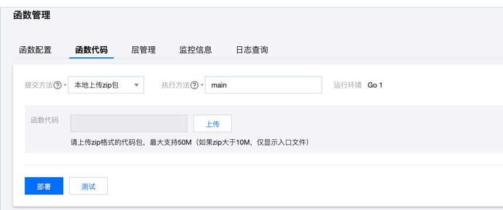

# Apitable golang SDK Example for SCF

[Apitable](https://apitable.com) Golang SDK， an application of the combined Tencent Serverless Cloud Function.

## Functional description

Read data from the apitable and delete it in batches. Read up to 100 records at a time.

## Quickstart

### environmental requirements

go 1.15 +  

### 1. install dependency

```shell
go mod tidy
```

### 2. compile and package

* The Linux or MacOS terminal completes compilation and packaging through the following methods:

```shell
GOOS=linux GOARCH=amd64 go build -o main main.go

zip main.zip main
```

* pack under windows:  
please refer to Tencent Serverless Cloud Function [Golang](https://cloud.tencent.com/document/product/583/67385)

### 3. upload the packaged zip package


### 4. add environment variable

Please add the following environment variables to Serverless Cloud Function.

```YAML
DATASHEET_ID

SORT_FIELD_NAME

VIEW_ID

# Visit the workbench of apitable, click on the personal avatar in the lower left corner, and enter [My Setting > Developer].
# click generate token (binding email required for first use).
APITABLE_TOKEN=
```

## todo
